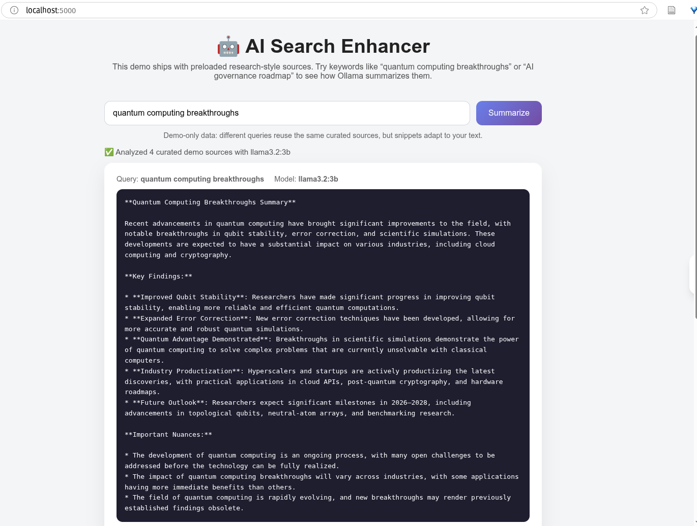

# 🤖 AI Search Enhancer

Enhance your web searches with AI-powered summaries using local Ollama models. Get instant, intelligent summaries of curated search results without leaving the app, thanks to a built-in search page that runs entirely on your machine.

## Demo




## 🌟 Features

- **🔍 Built-in Search UI**: Type a query in the local web UI and see a demo summary instantly
- **🤖 AI-Powered Summaries**: Uses local Ollama models (llama3.2, phi3, gemma2)
- **🔒 Privacy First**: All AI processing happens locally, no external API calls
- **⚡ Fast & Lightweight**: One lightweight Flask app + Ollama, no browser extensions required
- **🎨 Beautiful UI**: Clean, modern interface with smooth animations
- **📊 Smart Analysis**: Extracts and analyzes top 10 search results
- **🧪 Demo Ready**: Ships with sample results so you can test the summary flow without live scraping

## 🚀 Quick Start

### Prerequisites

1. **Ollama** - Local AI runtime
2. **Python 3.8+** - For the proxy server
3. **Modern Browser** - Chrome, Firefox, or Safari

### Installation

#### 1. Install Ollama

```bash
# macOS/Linux
curl -fsSL https://ollama.com/install.sh | sh

# Or download from https://ollama.ai
```

#### 2. Pull an AI Model

```bash
# Recommended: Small and fast
ollama pull llama3.2:3b

# Alternatives:
# ollama pull phi3:mini
# ollama pull gemma2:2b
```

#### 3. Clone and Setup

```bash
git clone <repository-url>
cd ai-search-enhancer

# Install Python dependencies
pip install -r requirements.txt
```

#### 4. Start Services

**Terminal 1 - Start Ollama:**
```bash
ollama serve
```

**Terminal 2 - Start Proxy Server (auto-reloads on save):**
```bash
python src/server.py
```

You should see:
```
🚀 Starting AI Search Enhancer Server...
📍 Server: http://127.0.0.1:5000
🤖 Checking Ollama connection...
✅ Ollama connected: http://localhost:11434
✅ Model: llama3.2:3b
✨ Server ready!
```

#### 5. Open the Local Search Page

Visit [http://127.0.0.1:5000](http://127.0.0.1:5000) in your browser. You’ll see a search box where you can type any query and receive an Ollama-generated summary of the bundled demo results. The dev server runs in debug mode by default, so any code change triggers an automatic reload—no manual restarts needed. Set `DEBUG=false` in your environment if you prefer production-style behavior.

> Still prefer the bookmarklet flow? It’s available in `examples/install.html`, but the new UI makes everything work out of the box.

## 📖 Usage

1. **Open**: Navigate to [http://127.0.0.1:5000](http://127.0.0.1:5000) (or your configured host/port)
2. **Search**: Type any query (e.g., “what is machine learning”) and hit **Summarize**
3. **Wait**: The app loads our curated demo results for that topic and sends them to Ollama
4. **Read**: Review the structured summary plus the list of cited sources

> Want to plug in real search data? Swap out the demo helper in `src/server.py` with your preferred search API or the original bookmarklet flow.

### Example

Searching for "what is machine learning" will show:
- Brief overview of machine learning
- Key concepts and applications
- Important nuances and caveats
- Citations to the curated sources bundled with the demo data

## 🏗️ Architecture

```
Local Search Page → Demo Result Provider → Flask Server → Ollama → AI Summary UI
```

### Components

1. **Search UI** (`src/templates/index.html`)
   - Simple form served by Flask
   - Calls the `/search` endpoint
   - Displays the summary + sources

2. **Proxy Server** (`src/server.py`)
   - Flask-based REST API
   - Handles CORS for bookmarklet (still supported)
   - Communicates with Ollama
   - Validates and formats data

3. **Demo Result Provider** (`get_demo_results` helper inside `src/server.py`)
   - Returns a curated list of research-style results for the current query
   - Easy to swap out for a real search API or the bookmarklet workflow

4. **Ollama Client** (`src/ollama_client.py`)
   - Python wrapper for Ollama API
   - Handles AI text generation
   - Model management and health checks

## 🔧 Configuration

Edit `src/config.py` to customize:

```python
# AI Model
OLLAMA_MODEL = "llama3.2:3b"  # Change to your preferred model

# Server
SERVER_PORT = 5000

# Summary Settings
SUMMARY_MAX_TOKENS = 500
TEMPERATURE = 0.3  # Lower = more focused
```

## 🧪 Testing

### Test Ollama Connection

```bash
curl http://localhost:11434/api/tags
```

### Test Proxy Server

```bash
curl http://localhost:5000/health
curl http://localhost:5000/ollama/status
```

### Test Summary Generation

```bash
curl -X POST http://localhost:5000/test
```

## 📁 Project Structure

```
ai-search-enhancer/
├── src/
│   ├── server.py              # Flask proxy server
│   ├── ollama_client.py       # Ollama API client
│   ├── config.py              # Configuration
│   ├── templates/
│   │   └── index.html         # Built-in web UI
│   └── bookmarklet.js         # Browser bookmarklet
├── examples/
│   └── install.html           # Installation page
├── tests/
│   └── test_server.py         # Unit tests
├── docs/
│   └── ai-search-enhancer-plan.md
├── requirements.txt           # Python dependencies
└── README.md
```

## 🤖 Supported Models

| Model | Size | Speed | Quality |
|-------|------|-------|---------|
| llama3.2:3b | 3B | ⚡⚡⚡ | ⭐⭐⭐⭐ |
| phi3:mini | 3.8B | ⚡⚡ | ⭐⭐⭐⭐ |
| gemma2:2b | 2B | ⚡⚡⚡⚡ | ⭐⭐⭐ |
| qwen2.5:3b | 3B | ⚡⚡⚡ | ⭐⭐⭐⭐ |

## 🛠️ Troubleshooting

### "Ollama not running" error
```bash
# Make sure Ollama is running
ollama serve

# Check if it's accessible
curl http://localhost:11434/api/tags
```

### "Model not found" error
```bash
# Pull the model
ollama pull llama3.2:3b

# List available models
ollama list
```

### Bookmarklet doesn't work
- Ensure proxy server is running on port 5000
- Check browser console (F12) for errors
- Verify you're on a supported search engine
- Try with a different browser

### Slow responses
- Use a smaller model (gemma2:2b)
- Reduce MAX_RESULTS in config.py
- Lower SUMMARY_MAX_TOKENS

## 🔒 Privacy & Security

- ✅ **No external API calls** - All processing is local
- ✅ **No data collection** - Your searches stay private
- ✅ **Open source** - Fully auditable code
- ✅ **Local-only server** - Proxy runs on localhost only

## 📝 API Endpoints

### POST /summarize
Generate AI summary of search results

**Request:**
```json
{
  "query": "machine learning",
  "results": [
    {
      "title": "What is Machine Learning?",
      "url": "https://example.com",
      "snippet": "Machine learning is..."
    }
  ]
}
```

**Response:**
```json
{
  "success": true,
  "query": "machine learning",
  "summary": "Machine learning is a subset of AI...",
  "model": "llama3.2:3b",
  "num_results": 10
}
```

### GET /health
Health check

### GET /ollama/status
Check Ollama connection status

### GET /models
List available Ollama models

## 🤝 Contributing

Contributions welcome! Please:

1. Fork the repository
2. Create a feature branch
3. Make your changes
4. Add tests
5. Submit a pull request

## 📄 License

MIT License - See LICENSE file for details

## 🙏 Credits

- Powered by [Ollama](https://ollama.ai)
- Built with Flask and vanilla JavaScript
- Inspired by the need for privacy-first AI tools

## 📧 Support

- GitHub Issues: Report bugs and request features
- Documentation: Check `docs/` folder for detailed guides

---

**Made with ❤️ for privacy-conscious AI enthusiasts**
