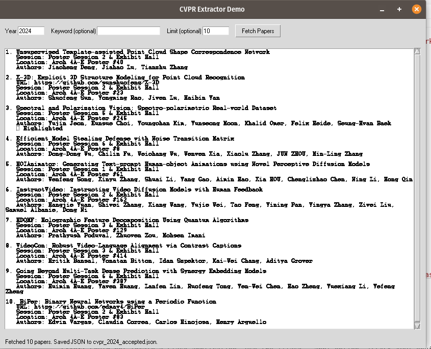

# CVPR Extractor Demo

This repository contains a quick demo that downloads the CVPR “Accepted Papers” page (default year 2024), parses every entry, and exports structured data including title, authors, session, and poster location. Results are automatically saved to `cvpr_<year>_accepted.json`, making it easy to show a working prototype ahead of the January 17 deadline.

## Demo



## Quick Start

```bash
python3 -m venv .venv
source .venv/bin/activate
pip install -r requirements.txt
python cvpr_extractor.py --year 2024 --limit 5
```

Need to focus on a specific topic (for example “diffusion”)? Pass a keyword to filter server-side results. You can also override the JSON filename if you want to archive multiple runs:

```bash
python cvpr_extractor.py --keyword diffusion --limit 20 --json diffusion.json
```

Add `--no-json` if you only want to print to the console without saving a file.

## Simple Web Front-End

Prefer a browser UI instead of the CLI? Launch the Flask app and open it locally:

```bash
export FLASK_APP=web_app.py  # or run `python web_app.py`
flask run
```

The page lets you enter the year/keyword/limit, fetch papers from the official CVPR site, preview the results, and automatically saves the JSON file for reuse.

## Sample Output

```
1. Guided Slot Attention for Unsupervised Video Object Segmentation
   Session: Poster Session 1 & Exhibit Hall
   Location: Arch 4A-E Poster #352
   Authors: Minhyeok Lee, Suhwan Cho, Dogyoon Lee, Chaewon Park, Jungho Lee, Sangyoun Lee

Displayed 1 records.
```

## Workflow Overview

- `cvpr_extractor.py`: core scraper; fetches CVPR HTML, parses each row, exposes CLI options for year, keyword, limit, and JSON export.
- `gui_app.py`: minimal Tkinter wrapper so you can enter year/keyword in a GUI and see formatted results; run `python gui_app.py` to launch (it also saves the JSON automatically).
- `web_app.py` + `templates/index.html`: lightweight Flask front-end that renders a simple form + results list in the browser; run with `flask run` or `python web_app.py`.
- `requirements.txt`: minimal dependencies (`requests` and `beautifulsoup4`).

Next steps for the broader project could include piping the JSON into a database, feeding it to a front-end, or wrapping the extractor in an API/cron job—adjust as needed for Project 1’s deliverables.
