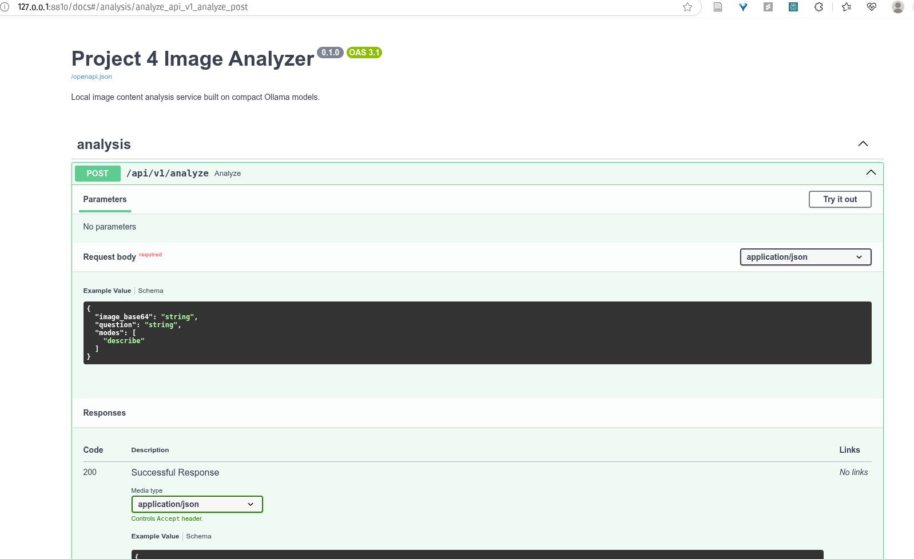

# Project 4 – Image Content Analysis (Ollama Edition)

Local-first image reasoning pipeline that stitches together lightweight vision models served via Ollama, classical detectors, and OCR tools to mimic GPT-4o-style capabilities without remote APIs.

## Getting Started

1. **Prerequisites**
   - macOS / Linux with Python 3.11+
   - [Ollama](https://ollama.ai) installed and running
   - Optional: Homebrew for installing PaddleOCR/Tesseract dependencies

2. **Install dependencies**
   ```bash
   cd project-4-image
   python -m venv .venv
   source .venv/bin/activate  # Windows: .venv\Scripts\activate
   pip install -r requirements.txt
   ```

3. **Pull lightweight vision models (default = moondream 1.8B)**
   ```bash
   ./scripts/bootstrap_models.sh            # pulls moondream by default
   # Need a different model? e.g. ./scripts/bootstrap_models.sh llava:7b
   ```

> 💡 `moondream` (~1.8B) is the lightest option available via Ollama today and works on low-RAM, iGPU-only machines. Add multiple models to `.env` if you want fallbacks.

4. **Run the API (default: 127.0.0.1:8810, avoiding port 8000 conflict)**
   ```bash
   # Make sure you're in the project directory and venv is activated
   uvicorn app.main:app --host 127.0.0.1 --port 8810 --reload --app-dir src
   ```
   > If port 8810 is still occupied, you can change `--port` to any unused port (e.g., 8811, 8820, etc.).

5. **Access the API**
   - **API Documentation (Swagger UI)**: http://127.0.0.1:8810/docs
   - **Alternative Docs (ReDoc)**: http://127.0.0.1:8810/redoc
   - **Health Check**: http://127.0.0.1:8810/health

6. **Test**
   ```bash
   pytest
   ```

## Quick Start - Command Line Tool

The easiest way to analyze images is using the command-line tool:

```bash
# Basic usage - just describe the image
python scripts/analyze_image.py path/to/your/image.jpg

# With a question
python scripts/analyze_image.py path/to/your/image.jpg --question "What is in this image?"

# Specify analysis modes
python scripts/analyze_image.py path/to/your/image.jpg --question "What text is visible?" --modes describe,ocr

# Or use the script directly (if executable)
./scripts/analyze_image.py path/to/your/image.jpg
```

**Demo:**



**Example output:**
```
Reading image: photo.jpg
Analyzing image...

============================================================
ANALYSIS RESULTS
============================================================

📝 Summary:
This image shows a beautiful sunset over a mountain landscape...

🏷️  Tags: sunset, mountain, landscape, sky, clouds

🤖 Model used: moondream
💾 Results saved to: artifacts/job-20260127203045123456.json
============================================================
```

## Usage Examples

### Using Command Line Tool (Recommended)

```bash
# Simple description
python scripts/analyze_image.py my_photo.jpg

# Ask a question
python scripts/analyze_image.py my_photo.jpg -q "What is written on the sign?"

# Multiple modes
python scripts/analyze_image.py my_photo.jpg -m describe,tags,qa
```

### Using curl

```bash
# First, encode your image to base64
IMAGE_B64=$(base64 -i your_image.jpg)

# Send analysis request
curl -X POST http://127.0.0.1:8810/api/v1/analyze \
  -H "Content-Type: application/json" \
  -d "{
    \"image_base64\": \"$IMAGE_B64\",
    \"question\": \"What is in this image?\",
    \"modes\": [\"describe\", \"qa\", \"tags\"]
  }"
```

### Using Python

```python
import base64
import requests

# Read and encode image
with open("your_image.jpg", "rb") as f:
    image_b64 = base64.b64encode(f.read()).decode("utf-8")

# Send request
response = requests.post(
    "http://127.0.0.1:8810/api/v1/analyze",
    json={
        "image_base64": image_b64,
        "question": "What is written on the sign?",
        "modes": ["describe", "qa", "ocr"]
    }
)

result = response.json()
print(f"Summary: {result['summary']}")
print(f"Tags: {result['tags']}")
print(f"Model used: {result['model_used']}")
```

### API Endpoints

- `POST /api/v1/analyze` - Analyze an image
  - **Request body**:
    - `image_base64` (required): Base64-encoded image
    - `question` (optional): Question about the image
    - `modes` (optional): List of modes - `["describe", "tags", "qa", "ocr"]`
  - **Response**: JSON with `summary`, `tags`, `answer`, `ocr_text`, `detections`, `model_used`, `artifacts_path`

- `GET /health` - Health check endpoint

## Project Status

✅ **Completed:**
- Basic image analysis pipeline
- Ollama integration with moondream model
- REST API with FastAPI
- Image validation and processing
- Artifact storage (results saved to `artifacts/` directory)

🚧 **In Progress / Planned:**
- OCR functionality (PaddleOCR/Tesseract integration)
- Object detection (classical detectors)
- Multiple model fallback support
- Batch processing worker

See `docs/project-4-image-content-analysis-plan.md` for the detailed roadmap.
